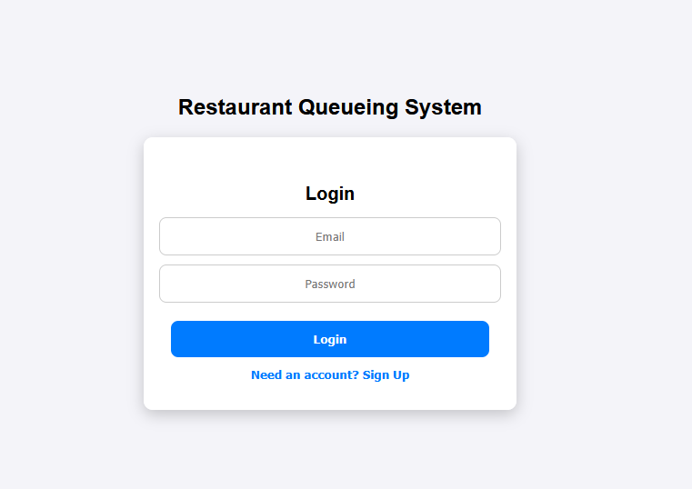
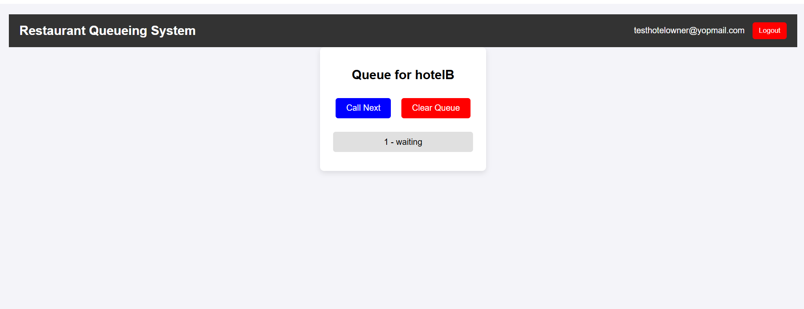
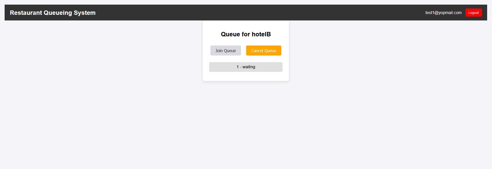
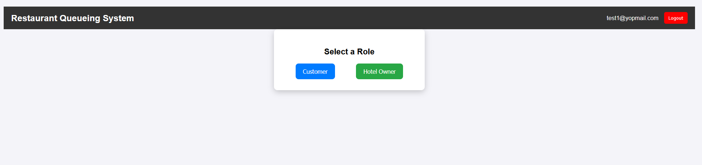

# Restaurant Queueing System

## 🚀 Overview
The **Restaurant Queueing System** is a **React-based web application** that helps manage customer queues for multiple hotels. Users can select a role (**Customer or Hotel Owner**), join the queue, call the next customer, and clear the queue efficiently. The application integrates **Firebase Authentication** and **Firestore Database** for real-time queue management.

---

## 🎯 Features
✅ **User Authentication** (Sign Up / Login via Firebase Auth)  
✅ **Role-Based Access** (Customer / Hotel Owner)  
✅ **Join & Cancel Queue** (Customers)  
✅ **Call Next & Clear Queue** (Hotel Owners)  
✅ **Real-time Updates** (Firestore Database)  
✅ **Responsive & Neat UI**  

---

## 📂 Folder Structure
```
restaurant-queuing-system/
│-- src/
│   ├── components/
│   │   ├── Navbar.js
│   │   ├── Auth.js
│   │   ├── RoleSelection.js
│   │   ├── HotelSelection.js
│   │   ├── QueueSelection.js
│   ├── styles/
│   │   ├── global.css
│   │   ├── auth.css
│   │   ├── roleSelection.css
│   │   ├── hotelSelection.css
│   ├── firebase.js
│   ├── App.js
│   ├── index.js
│-- public/
│-- package.json
│-- README.md
```

---

## 🔧 Setup & Installation
### 1️⃣ Clone the Repository
```sh
 git clone https://github.com/YOUR_USERNAME/restaurant-queuing-system.git
 cd restaurant-queuing-system
```

### 2️⃣ Install Dependencies
```sh
npm install
```

### 3️⃣ Configure Firebase
- Go to [Firebase Console](https://console.firebase.google.com/)
- Create a new project & enable **Authentication & Firestore**
- Replace `firebaseConfig` in **src/firebase.js** with your credentials

```javascript
const firebaseConfig = {
  apiKey: "YOUR_API_KEY",
  authDomain: "YOUR_AUTH_DOMAIN",
  projectId: "YOUR_PROJECT_ID",
  storageBucket: "YOUR_STORAGE_BUCKET",
  messagingSenderId: "YOUR_MESSAGING_SENDER_ID",
  appId: "YOUR_APP_ID"
};
```

### 4️⃣ Start the Development Server
```sh
npm start
```

---

## 📸 Screenshots
| **Login Page** | **Queue Management** |
|---------------|--------------------|
|  |  |
------------------------------------------------------------------------------------------------------
| **Customer Queue** | **Role Selection** |
|-------------------|------------------|
|  |  |
-------------------------------------------------------------------------------------------------
---

## 💡 Future Enhancements
🚀 **Admin Dashboard** for better queue insights  
🚀 **Email Notifications** for customers when their turn is near  
🚀 **Dynamic Hotel Registration** instead of hardcoded hotels  

---

## 🤝 Contributing
Contributions are welcome! Feel free to fork, create a branch, and submit a pull request.  

---

## 📜 License
This project is licensed under the **MIT License**.

